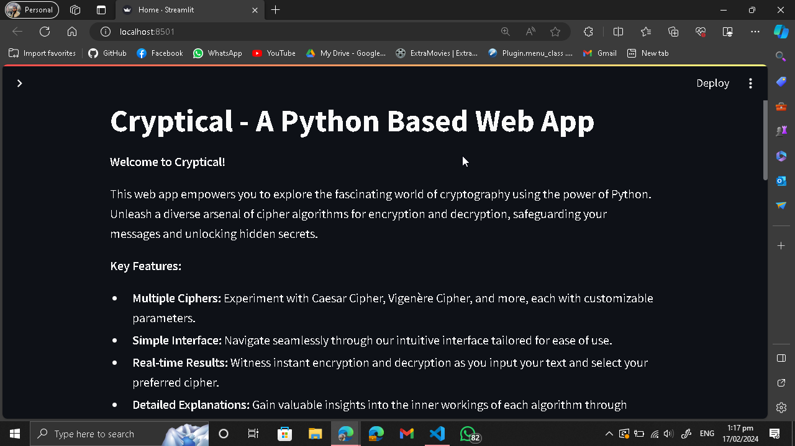
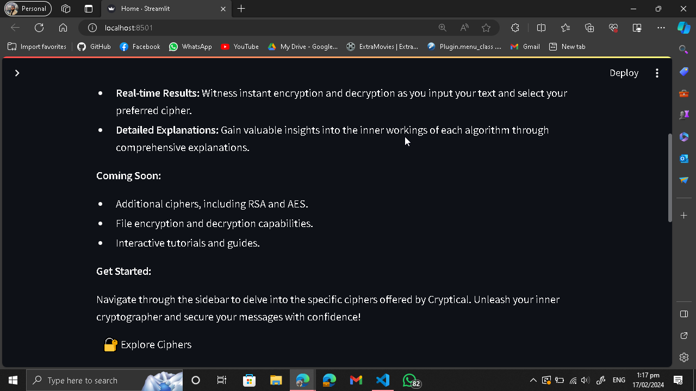
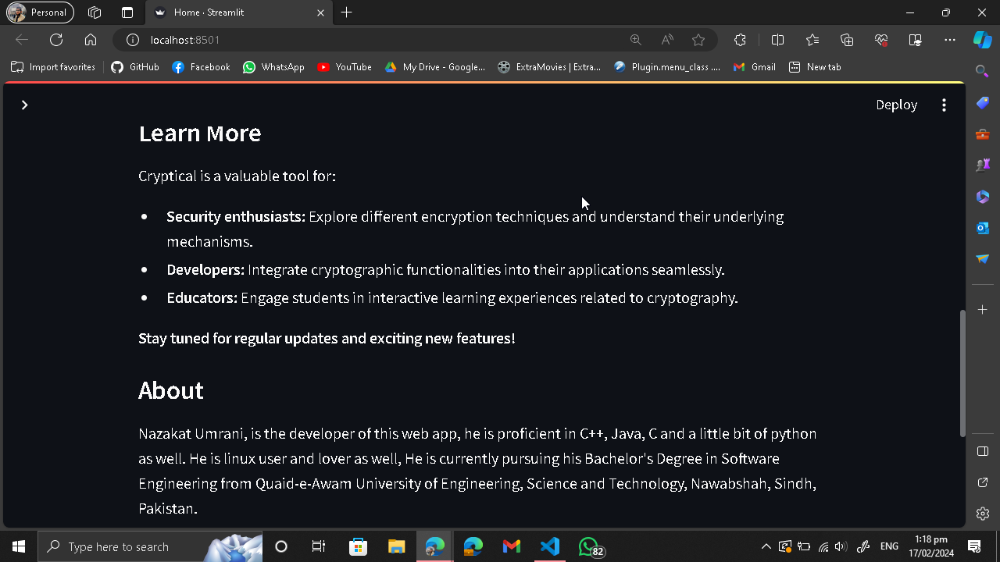
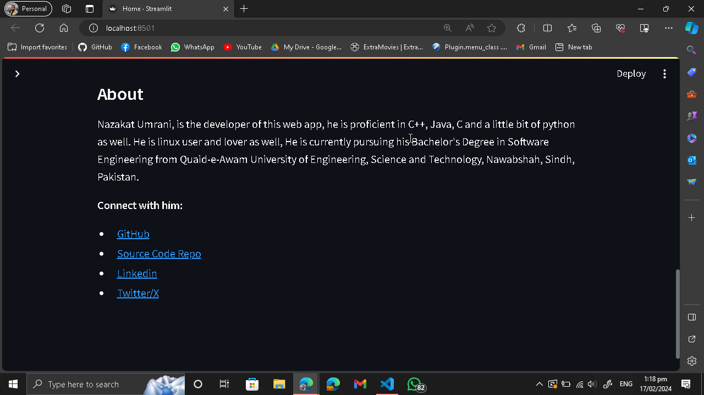
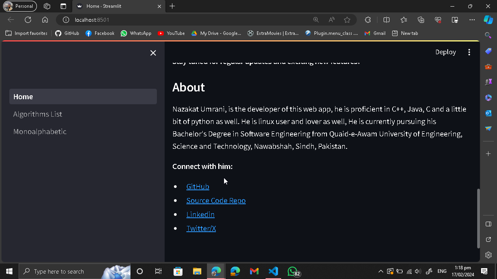
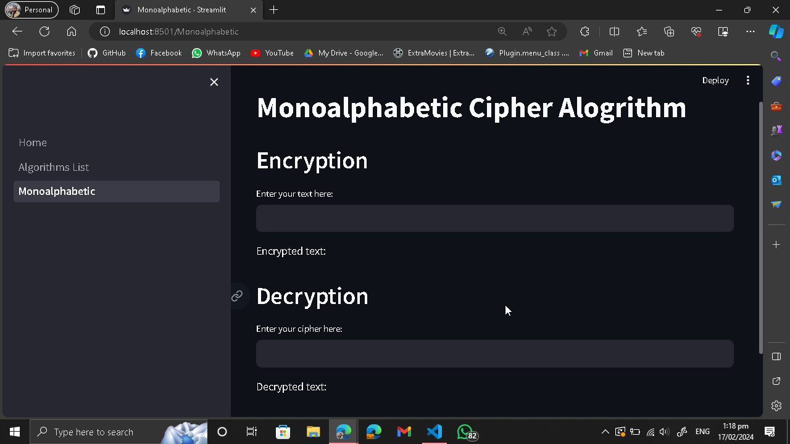
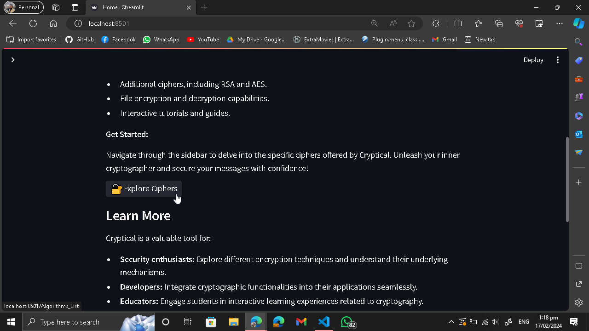

<h1>
 Cryptical - Cypher Algos
</h1>

<h2>Descryption</h2>

Started this new project, it will be a python web app for encryption and decryption of text, I am going to use Streamlit library to make a python web app,

<h2>Screenshots</h2>

